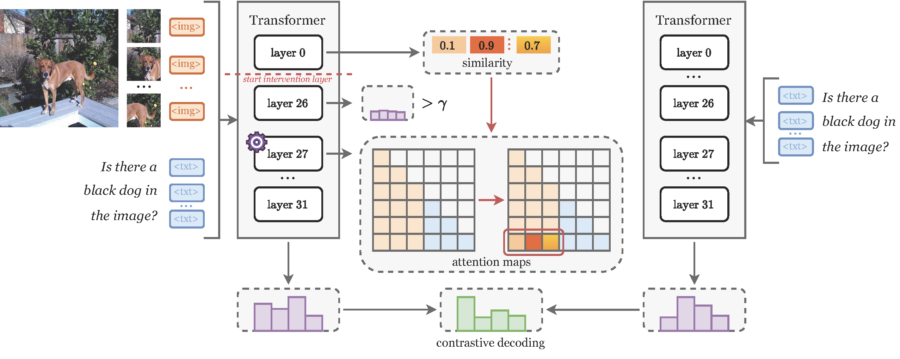

# [ECCV 2026] CAI: Context-Aware Attention Intervention

[](https://arxiv.org/pdf/2606.29847)
[](https://eccv.ecva.net/)
[](https://opensource.org/licenses/MIT)


## 👀 Introduction

This repository contains the code for our ECCV 2026 paper `See Only When Needed: Context-Aware Attention Intervention for Mitigating Hallucinations in LVLMs`. 

<div align="center">
  
</div>


## 💡 Getting Started

### 1. Install Dependencies

Our codebase is tested with PyTorch 2.0.1. Please install the appropriate PyTorch and CUDA versions based on your computational resources.

```
conda create -n CAI python=3.10
conda activate CAI
git clone https://github.com/Iris1946/CAI.git
cd CAI
pip install -r requirements.txt
python -m pip install -e transformers
```

### 2. Prepare Models & Datasets
To run the evaluations, you will need to download the following model weights and datasets:

- **Model Checkpoints**: Download [LLaVA-1.5 merged 7B](https://huggingface.co/liuhaotian/llava-v1.5-7b).

- **Datasets**: Download images and annotations from [MSCOCO website](https://cocodataset.org/).


## 📦 Usage

We provide the scripts to evaluate CAI on the POPE benchmark. You can quickly reproduce our experiments by running the following command:

```
bash scripts/pope_eval.sh
```


## 🙏 Acknowledgements
Our codebase is built upon several excellent open-source projects. We would like to thank the authors of the following repositories for releasing their code:
[VCD](https://github.com/DAMO-NLP-SG/VCD), [OPERA](https://github.com/shikiw/OPERA), [LLaVA](https://github.com/haotian-liu/LLaVA), [DeGF](https://github.com/zhangce01/DeGF/tree/main) and [ONLY](https://github.com/zifuwan/ONLY).

## 📧 Contact

If you have any questions, please  contact [leiyuqing231@mails.ucas.ac.cn](mailto:leiyuqing231@mails.ucas.ac.cn).

## 📌 BibTeX & Citation

If you find this code useful, please consider citing our work:

```bibtex
@article{lei2026cai,
  title={See Only When Needed: Context-Aware Attention Intervention for Mitigating Hallucinations in LVLMs}, 
  author={Yuqing Lei and Wenbo Lyu and Yingjun Du and Xiantong Zhen and Cees G. M. Snoek and Ling Shao},
  journal={arXiv preprint arXiv:2606.29847},
  year={2026}
}
```
